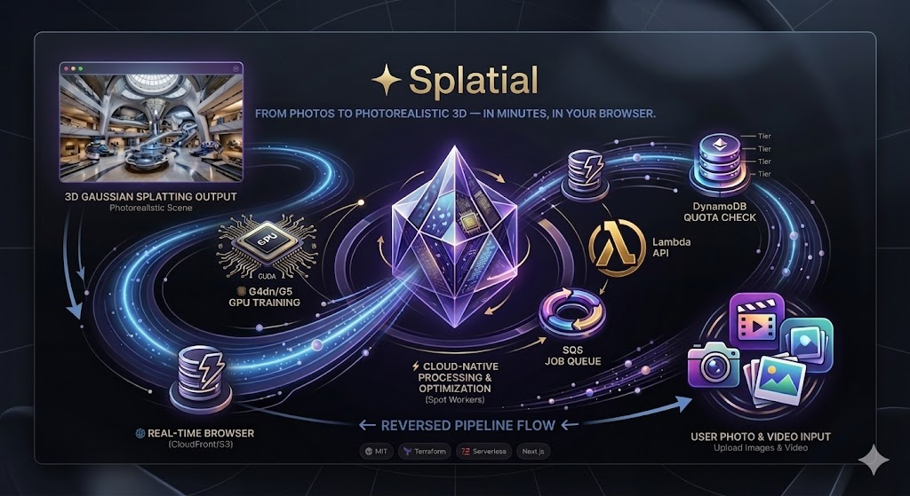
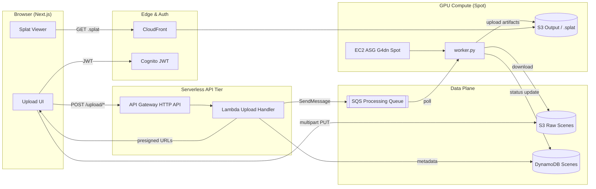

<div align="center">

# ✦ Splatial

**Cloud-native 3D Gaussian Splatting platform — ingest, train, and serve photorealistic scenes at scale.**

[](https://github.com/zinelaabidinenadir/splatial/actions/workflows/deploy.yml)
[](#-license)
[](https://www.terraform.io/)
[](https://aws.amazon.com/)
[](https://github.com/features/actions)
[](https://nextjs.org/)

*Asynchronous media pipeline · Infrastructure as Code · Spot-first GPU compute · Zero-standing credentials*

</div>

<div align="center">
  
</div>

---

## 📋 Executive Overview

**Splatial** is a production-oriented, cloud-native platform for processing, storing, and serving **3D Gaussian Splats** — a next-generation radiance-field format for real-time, photorealistic 3D rendering in the browser.

The system is built around three architectural commitments that define every design decision:

| Principle | What it means in practice |
|---|---|
| **Automation first** | The full AWS stack — VPC, S3, CloudFront, API Gateway, Lambda, DynamoDB, SQS, Cognito, EC2 — is declared in Terraform and deployed through GitHub Actions with OIDC authentication. No manual console provisioning. |
| **Asynchronous by design** | The API tier never blocks on GPU training. Uploads complete in seconds; heavy compute runs on decoupled EC2 Spot workers fed by SQS. Lambda orchestrates metadata and state only. |
| **Cost efficiency at scale** | Scale-to-zero GPU workers, S3 Gateway Endpoints to eliminate NAT egress, Spot instances with S3 checkpointing and SQS re-queuing on interruption, and direct browser-to-S3 multipart uploads that bypass Lambda payload limits entirely. |

Splatial demonstrates end-to-end **Cloud and DevOps engineering**: multi-environment IaC, least-privilege IAM, event-driven orchestration, CI/CD pipelines, and operational patterns for long-running, interruptible GPU workloads.

> For the full as-built reference — network topology, IAM boundaries, DynamoDB schema, worker lifecycle, and remediation plan — see [`docs/ARCHITECTURE_REFERENCE.md`](./docs/ARCHITECTURE_REFERENCE.md).

---

## 🏗️ Architecture Deep-Dive

Splatial follows a **decoupled, event-driven pipeline**. The synchronous path (auth → presign → upload) completes in milliseconds; the asynchronous path (train → checkpoint → distribute) runs independently on GPU workers.

### End-to-End Flow



### Stage-by-Stage Breakdown

#### 1 · Ingestion — Direct-to-S3 Multipart Upload

Authenticated users upload large capture assets (video, image sets, ZIP datasets) from the browser. Lambda never receives binary data:

1. `POST /upload/init` — creates a multipart upload in S3 and a `PENDING_UPLOAD` record in DynamoDB.
2. `POST /upload/presign` — returns short-lived presigned URLs for each 5 MiB part.
3. Browser PUTs parts directly to S3 in parallel (6 concurrent streams).
4. `POST /upload/complete` — assembles the multipart upload and transitions the scene to a processing state.

All S3 keys are namespaced: `uploads/<userId>/<sceneId>/<filename>`.

#### 2 · Orchestration — Lambda + DynamoDB + SQS

After upload completion, Lambda dispatches a job message to SQS containing the scene ID, S3 key, and user context. DynamoDB tracks the full job lifecycle:

`UPLOADING → VALIDATING → QUEUED → INITIALIZING → PROCESSING_SFM → PROCESSING_TRAINING → COMPLETED | FAILED | INTERRUPTED | CANCELED`

The API returns `202`-style responses immediately; clients poll status via `GET /scenes/{sceneId}` or list scenes via `GET /api/v1/scenes`.

#### 3 · Processing — EC2 Spot GPU Workers

A custom AMI (`worker.py` + dependencies) boots on **G4dn Spot instances** inside private subnets. Each worker:

- Polls SQS for a single job (one message per instance).
- Downloads raw assets from S3, runs Structure-from-Motion (COLMAP) and 3D Gaussian Splatting training.
- Checkpoints progress to S3 on **Spot interruption** (2-minute warning) and re-queues the job.
- Uploads `.splat` / `.spz` output and updates DynamoDB to `COMPLETED`.
- Terminates itself and decrements ASG desired capacity (scale-to-zero at rest).

#### 4 · Distribution — CloudFront + In-Browser Rendering

Processed splats are served over CloudFront with Origin Access Control (OAC) and environment-scoped CORS. The Next.js viewer renders splats in real time via WebGL/WebGPU — no plugin or native install required.

### Security & IAM Model

- **Cognito JWT authorizer** on API Gateway validates every request before Lambda invocation.
- **GitHub OIDC** deploy role — no long-lived AWS access keys in CI.
- **IMDSv2 required** on worker instances; outbound-only security groups; management via SSM.
- **Least-privilege IAM** — discrete policy statements per service with resource-scoped ARNs.

---

## 🏛️ AWS Well-Architected Alignment

This platform is intentionally designed around the AWS Well-Architected Framework, with clear tradeoffs across cost, reliability, performance, and security:

- **Cost Optimization (FinOps):** Spot-first GPU compute significantly reduces the cost of asynchronous training workloads, and S3 Gateway Endpoints help avoid unnecessary NAT Gateway egress charges.
- **Reliability:** The decoupled SQS-based execution model ensures that interrupted Spot jobs can be retried safely without losing the original work item; state is preserved in DynamoDB and S3 checkpoints.
- **Performance Efficiency:** Direct browser-to-S3 multipart uploads bypass API Gateway and Lambda payload constraints, allowing large datasets to flow into the platform without creating a bottleneck in the web tier.
- **Security:** The platform uses GitHub OIDC for CI/CD authentication, enforces IMDSv2 on compute hosts, and applies least-privilege IAM so workloads run without standing credentials or broad access.

## 🛠️ Technology Stack

### ☁️ Cloud & Infrastructure as Code

| Technology | Role |
|---|---|
| **Terraform** `>= 1.10` | Full AWS stack: modules for `dev`, `staging`, `prod` with remote S3 state + DynamoDB locking |
| **AWS VPC** | Multi-AZ public/private subnets, NAT gateways, S3 Gateway Endpoint |
| **Amazon S3** | Static site hosting, raw upload bucket (Transfer Acceleration), processed output |
| **Amazon CloudFront** | CDN with OAC (sigv4), TLS 1.2+, custom error pages |
| **API Gateway HTTP API** | RESTful routes with Cognito authorizer, custom domain + ACM |
| **AWS Lambda** | Node.js 18 upload orchestration (CommonJS, AWS SDK v3) |
| **Amazon DynamoDB** | Scene records, GSI for user queries, TTL, point-in-time recovery |
| **Amazon SQS** | Processing queue + DLQ for async job dispatch |
| **Amazon Cognito** | User pool, JWT sessions, email/SSRP auth |
| **EC2 Spot (G4dn)** | GPU training workers with custom AMI, launch template, ASG |
| **Route 53 + ACM** | DNS and TLS for `splatial-<env>.openspacenexus.store` |
| **GitHub Actions** | Lint, Terraform fmt, `terraform apply`, Next.js build, S3 sync, CloudFront invalidation |

### ⚙️ Backend & Processing

| Technology | Role |
|---|---|
| **Node.js 18 (Lambda)** | Multipart upload orchestration, scene CRUD, job dispatch |
| **Python 3 (worker.py)** | SQS consumer, S3 I/O, COLMAP + 3DGS training, Spot interruption handling |
| **Docker** | Worker AMI bake pipeline and reproducible GPU training environments *(roadmap)* |
| **COLMAP / 3DGS** | Structure-from-Motion pose estimation and Gaussian Splatting optimization |
| **Amazon SSM** | Worker instance management without inbound SSH |

### 🎮 Spatial / 3D

| Technology | Role |
|---|---|
| **Next.js 16 + React 19 + TypeScript** | App Router frontend, Amplify auth, dashboard, upload UX |
| **WebGL / WebGPU Splat Viewer** | Real-time `.splat` / `.spz` rendering in-browser (`GaussianViewer`, `@mkkellogg/gaussian-splats-3d`) |
| **Three.js** | 3D scene graph, camera trajectories, MP4 export |
| **Modern C++** | High-performance depth sorting, binary splat parsing, and compute kernels *(roadmap)* |
| **Unreal Engine 5** | Scene export, cinematic workflows, and spatial content pipelines *(roadmap)* |

---

## 🌐 Social & Interaction Layer

Beyond the core upload→train→view pipeline, Splatial ships a full social platform
layer — 15 features built as independent, deployable increments on top of the same
serverless stack (no new compute tier; each feature owns its DynamoDB table and a
set of routes on the existing API).

| Capability | Features |
|---|---|
| **Identity** | Unique usernames, public profiles (`/u/<username>`), avatars, bios, counters |
| **Graph & discovery** | Follow / unfollow, personalized feed (fan-out on read), global Explore, tags & categories |
| **Engagement** | Multi-type reactions, comments, `@mentions`, a notifications center with unread badge |
| **Curation** | Scene visibility (public/private), bookmarks / "Saved", remix / fork with lineage |
| **Camera authoring** | Saved viewpoints ("Shots"), shareable deep-links, and guided fly-through tours |

Engineering patterns worth noting: **transactional counters** (`TransactWriteItems`
for follower/reaction/comment counts — idempotent and non-negative), **denormalized
identity** on child records to avoid N+1 reads, **sparse GSIs** for filtered
listings, **best-effort** notification emission that never fails the primary action,
and safe **plain-text rendering** of all user content.

> Full as-built reference — data model, every endpoint, per-feature invariants, and
> upgrade paths — in [`docs/SOCIAL_FEATURES_REFERENCE.md`](./docs/SOCIAL_FEATURES_REFERENCE.md).

---

## 🚀 Deployment

Splatial is provisioned entirely through **Terraform**. Application code is deployed via **GitHub Actions** using branch-to-environment mapping.

### Prerequisites

| Tool | Version |
|---|---|
| [Terraform](https://www.terraform.io/) | `>= 1.10` |
| [Node.js](https://nodejs.org/) | `>= 20` |
| [AWS CLI](https://aws.amazon.com/cli/) | `>= 2.x` |
| AWS account with appropriate IAM permissions | — |

### One-Time Bootstrap (Remote State)

```bash
cd infra/bootstrap
terraform init
terraform apply   # Creates S3 state bucket + DynamoDB lock table
```

### Deploy an Environment

```bash
# Configure environment variables
cp infra/envs/dev/terraform.tfvars.example infra/envs/dev/terraform.tfvars
# Edit terraform.tfvars with your domain, GitHub repo, and hosted zone

cd infra/envs/dev
terraform init
terraform fmt -recursive ../../
terraform validate
terraform plan
terraform apply
```

Repeat for `infra/envs/staging/` and `infra/envs/prod/` as environments mature.

### Local Frontend Development

```bash
cd frontend
npm install
cp .env.local.example .env.local   # Populate from Terraform outputs
npm run dev                        # http://localhost:3000
```

### CI/CD Pipeline

Every push to a tracked branch triggers the full pipeline:

| Branch | Environment | Terraform Root |
|---|---|---|
| `dev` | Development | `infra/envs/dev` |
| `staging` | Staging | `infra/envs/staging` |
| `main` | Production | `infra/envs/prod` |

The pipeline authenticates to AWS via **GitHub OIDC** — no static credentials stored in repository secrets. Required GitHub environment configuration: `AWS_ACCOUNT_ID` (role ARN resolved dynamically from branch name).

---

## 📁 Repository Structure

```
splatial/
├── infra/                          # All Infrastructure as Code (Terraform)
│   ├── bootstrap/                  # One-time remote state backend
│   ├── envs/                       # Per-environment roots (dev / staging / prod)
│   └── modules/
│       ├── static-site/            # Primary module: VPC, S3, Lambda, SQS, EC2, Cognito…
│       └── api-gateway-domain/     # Custom API domain + ACM + Route 53
├── backend/                        # Lambda handler source (Node.js, CommonJS)
├── frontend/                    # Next.js 16 frontend (TypeScript, Amplify, splat viewer)
├── worker/                         # Python SQS GPU worker (EC2 Spot)
├── docs/                           # Architecture reference, Postman collections
└── .github/workflows/              # CI/CD (deploy.yml, bootstrap.yml)
```

---

## 🗺️ Roadmap & Upcoming Features

> **📌 Tracking:** Each item below corresponds to an active [GitHub Issue](https://github.com/zinelaabidinenadir/splatial/issues). Issues are the source of truth for scope, acceptance criteria, and assignment.

### Infrastructure & Cloud Operations

Focused on CI/CD maturity, auto-scaling, Terraform state management, and production hardening — the core competencies for Cloud and DevOps engineering roles.

- [ ] **Enable EC2 Spot ASG with SQS target-tracking auto-scaling** — Uncomment and validate the ASG + customized CloudWatch metric policy in `compute.tf`; scale from zero based on `ApproximateNumberOfMessagesVisible`.
- [ ] **Convert SQS processing queue to FIFO with deduplication** — Enforce exactly-once job dispatch; update Lambda `SendMessage` parameters and worker queue resolution.
- [ ] **Provision VPC interface endpoints** — Add SQS, DynamoDB, and SSM endpoints in private subnets to eliminate NAT dependency for worker traffic and enable SSM Session Manager debugging.
- [ ] **Complete staging and prod environment parity** — Populate `infra/envs/staging/` and `infra/envs/prod/` with production-grade settings (`prevent_destroy`, KMS encryption, stricter CORS).
- [ ] **Harden GitHub Actions CI/CD pipeline** — Add Terraform `validate` + plan-on-PR gates, frontend `npm run build` in CI, environment promotion workflow, and deployment smoke tests post-apply.
- [ ] **Eliminate hardcoded AWS account IDs in Terraform** — Replace literals with `data.aws_caller_identity.current` for multi-account portability.
- [ ] **Docker-based worker AMI bake pipeline** — Replace manual AMI builds with a reproducible Dockerfile + Packer/GitHub Actions workflow for COLMAP, CUDA, and 3DGS dependencies.
- [ ] **CloudWatch observability stack** — Structured Lambda logs, SQS DLQ alarms, ASG scaling event dashboards, and Spot interruption rate monitoring.
- [ ] **Terraform state migration tooling** — Document and automate workspace moves, module extraction, and `moved` block strategies for zero-downtime refactors.
- [ ] **Remove legacy scaffold resources** — Delete unused `myfunc` Lambda, `GET /helloFromLambda` route, and committed zip artifacts from version control.
- [ ] **Attach `AmazonSSMManagedInstanceCore` to worker role** — Enable shell-free instance debugging via SSM Session Manager.

### Application & Spatial Features

Focused on the media pipeline, 3D rendering experience, and spatial content workflows.

- [ ] **Wire COLMAP video pipeline in worker AMI** — Replace simulation fallback for `.mp4`/`.mov` inputs with ffmpeg frame extraction + COLMAP automatic reconstruction.
- [ ] **Migrate `scenes-list` from Scan to GSI Query** — Add `user_id-created_at-index` to DynamoDB and update handler for scalable per-user scene listing.
- [ ] **User quota and tier system (Free / Pro)** — DynamoDB `UsersTable` with Cognito Post-Confirmation trigger; enforce per-user scene limits at the Lambda layer.
- [ ] **Processed asset bucket + CloudFront origin** — Dedicated S3 bucket for `.splat`/`.spz` output with presigned viewer URLs and correct CORS for WebGL/WebGPU.
- [ ] **Worker idempotency guard** — Check DynamoDB status before training to safely handle SQS duplicate delivery and visibility-timeout races.
- [ ] **Real-time splat viewer enhancements** — Level-of-detail streaming, `.spz` decompression in a Web Worker, and trajectory playback controls.
- [ ] **Modern C++ compute module for splat parsing** — WASM or native-addon depth sorting and binary buffer parsing to offload CPU-bound work from the main thread.
- [ ] **Unreal Engine 5 export pipeline** — Import trained splats into UE5 for cinematic rendering, Nanite-compatible mesh generation, and spatial content authoring workflows.
- [ ] **Google Drive import integration** — Complete the `gdrive-import` handler and frontend flow for cloud-sourced capture datasets.
- [ ] **Job cancellation and recovery UX** — Wire `cancel-job` and `attempt-heartbeat` handlers to the dashboard with live progress and Spot interruption recovery indicators.

---

## 📚 Documentation

| Document | Description |
|---|---|
| [`docs/ARCHITECTURE_REFERENCE.md`](./docs/ARCHITECTURE_REFERENCE.md) | Definitive as-built reference: network topology, IAM, data flows, known gaps, remediation plan |
| [`docs/SOCIAL_FEATURES_REFERENCE.md`](./docs/SOCIAL_FEATURES_REFERENCE.md) | As-built reference for the social & interaction layer (features 1–15): data model, API, per-feature invariants, upgrade paths |
| [`docs/architecture.md`](./docs/architecture.md) | System design narrative and cost model |
| [`docs/logging-spec.md`](./docs/logging-spec.md) | Logging & observability contract across backend, worker, infra, frontend |
| [`docs/CHANGELOG.md`](./docs/CHANGELOG.md) | Dated change log (what changed, why, where, how to verify) |
| [`CLAUDE.md`](./CLAUDE.md) | Engineering standards and architectural contract for contributors |
| [`docs/postman/`](./docs/postman/) | Postman collection and environment for API testing |

---

## 🤝 Contributing

Contributions are welcome. Please open an issue before submitting significant changes.

1. Fork the repository.
2. Create a feature branch: `git checkout -b feat/your-feature`
3. Commit using [Conventional Commits](https://www.conventionalcommits.org/) (`feat`, `fix`, `refactor`, etc.).
4. Open a pull request against `dev`.

---

## 📄 License

Released under the **MIT License** — see [`LICENSE`](./LICENSE) for the full text.

---

<div align="center">

**Built with ☁️ AWS · 🏗️ Terraform · ⚡ Spot GPU Compute · 🌐 Real-Time 3D**

</div>
