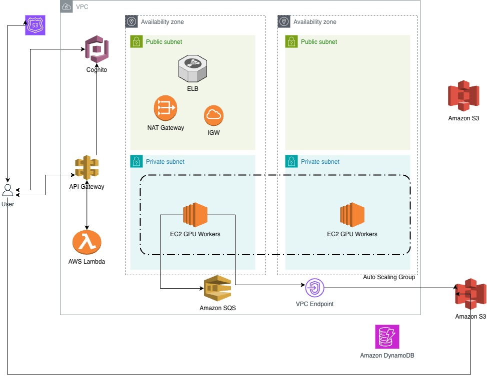

# Architecture

## Table of Contents

*   **1. Executive Summary**
    *   1.1 Project Objectives
    *   1.2 Design Philosophy & Core Principles (Serverless, Spot-first, IaC)
    *   1.3 Summary of Technologies
*   **2. Core Network Infrastructure (VPC)**
    *   2.1 Multi-AZ VPC Design & Subnet Strategy
    *   2.2 Public/Private Split and Internet Access (IGW/NAT Gateways)
    *   2.3 **[Reference Diagram: VPC Core Architecture]** (Image_0)
    *   2.4 Critical Cost Optimization: S3 Gateway Endpoint
*   **3. Overall System Architecture & Workflow**

    *   3.1 Architectural Overview (VPC Integration with Global Services)
    *   3.2 Asynchronous Design Pattern (Decoupling API from Processing)
    *   3.3 Component Responsibility Matrix
    *   3.4 **[Reference Diagram: Full Application Architecture]** (Image_2)
    *   3.5 Detailed End-to-End Workflows
        *   3.5.1 The Management Flow (Webapp & API)
        *   3.5.2 The Training Flow (EC2 Spot Workers)
        *   3.5.3 The Output/Viewing Flow
*   **4. Security and Identity Management (Cognito & API Gateway)**
    *   4.1 Authentication & Authorization Strategy
    *   4.2 Integrated **[Reference Diagram: Compact API Auth Workflow]** (Image_4)
    *   4.3 Secure Token Validation Path
    *   4.4 Principle of Least Privilege: IAM Roles for Lambdas & EC2
    *   4.5 Security Groups Configuration Matrix
*   **5. Compute Layer: Heavy Data Processing (GPU Workers)**
    *   5.1 Choosing EC2 G4dn/G5 Spot Instances
    *   5.2 Auto Scaling Group (ASG) Design & Mixed Instances Policy
    *   5.3 Handling Spot Interruptions Gracefully
        *   5.3.1 S3 Checkpointing Mechanism
        *   5.3.2 SQS Message Re-queuing
*   **6. Advanced DevOps Practices**
    *   6.1 Terraform Project Structure & Workspace Use (`dev`/`prod`)
    *   6.2 CI/CD Strategy with GitHub Actions
        *   6.2.1 Infrastructure CI/CD flow
        *   6.2.2 Application/Worker CI/CD flow
    *   6.3 Secret Management
*   **7. Scalability & Cost Governance**
    *   7.1 Cost Pillars and Monthly Estimate Assumptions
    *   7.2 Scaling Rules (Lambda Concurrency vs. ASG GPU counts)
*   **8. Limitations & Assumptions**

## 1. Executive Summary 

## 2. Core Network Infrastructure (VPC)

## 3. Overall System Architecture & Workflow
   Architecture 

### 3.1 Architectural Overview (VPC Integration with Global Services)
### 3.2 Asynchronous Design Pattern (Decoupling API from Processing)
### 3.3 Component Responsibility Matrix
### 3.4 **[Reference Diagram: Full Application Architecture]** (Image_2)
### 3.5 Detailed End-to-End Workflows
#### 3.5.1 Identity, Secure Access and Profile Workflow
##### Sign-up: 
User registers via the React frontend. AWS Cognito User Pool creates the identity, verifies the email, and triggers a Post-Confirmation Lambda function.

##### Profile Creation: 
The Lambda function initializes a user record in DynamoDB (e.g., UsersTable), setting default Tier (e.g., "Free", "Pro") and quota limits (e.g., max Scenes per month).

##### Login: 
User authenticates via Cognito, receiving ID, Access, and Refresh JWTs.

##### Token Refresh: 
Frontend silently refreshes expired tokens using the Refresh token to maintain session continuity.

#####  Request Verification: 
Frontend calls API Gateway passing the JWT in the Authorization header.

##### API Gateway Authorizer: 
API Gateway validates the JWT via a native Cognito Authorizer. Invalid/expired tokens are rejected (401 Unauthorized).

##### Quota Check (Edge Case): 
A VPC-integrated Lambda checks DynamoDB to ensure the user hasn't exceeded their daily/monthly Scene processing quotas. If exceeded, returns a 429 Too Many Requests response

#### 3.5.1 API Authorization

#### 3.5.3 Scene Ingestion Worklow
##### Request Upload
##### Multipart Upload Initialization
##### Direct-to-S3 Upload & Assembly

#### 3.5.2 Job Scheduling & Orchestration Workflow
#### 3.5.4 Spot Interruption & Recovery Workflow
#### 3.5.5 Splat Training Workflow (EC2 Spot Workers)
#### 3.5.6 Visualization & Splat Management Workflow
#### 3.5.7 Data Lifecycle & Cleanup Workflow

## 4. Security and Identity Management (Cognito & API Gateway)
## 5. Compute Layer: Heavy Data Processing (GPU Workers)
## 6. Advanced DevOps Practices
## 7. Scalability & Cost Governance
## 8. Limitations & Assumptions

